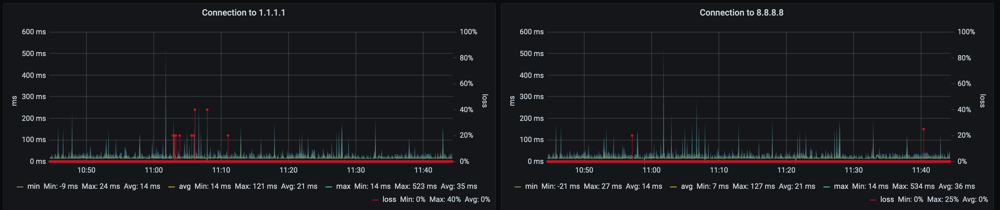
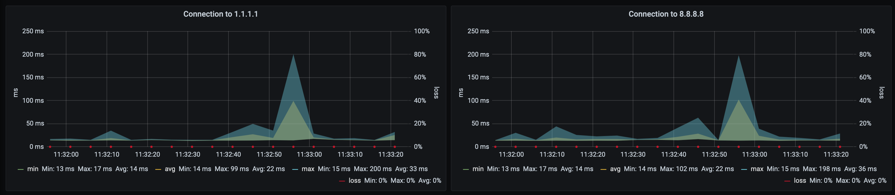

# infping.rb

This is a Ruby re-implementation of infping, originally written in Go, https://github.com/torhve/infping by Tor Hveem.

It uses fping to ping one or more targets, it will then store the data inside of InfluxDB, and if you connect Grafana to it you can create nice graphs:





This project is also hosted on Dockerhub: https://hub.docker.com/repository/docker/kaspergrubbe/infping-rb

## Run the project

If you just want to just run the project, the easiest way is just to clone this repository and run:

```bash
make run
```

This will start InfluxDB, Grafana and infping.rb, have a look at `docker-compose.yml` for details. It will also initialize the database within InfluxDB and setup a Dashboard named "Pings" in Grafana.

The default `username/password` for Grafana is `admin/admin`, and you can find the pre-configured "Infping.rb" dashboard in the overview here: http://localhost:3031/dashboards or by going to Dashboards -> Manage.

## Configuring

infping.rb does not have any configuration files but uses environment variables instead:

- `INFLUXDB_HOSTNAME` InfluxDB hostname.
- `INFLUXDB_DATABASE` InfluxDB database.
- `INFLUXDB_USERNAME` InfluxDB username.
- `INFLUXDB_PASSWORD` InfluxDB password.
- `HOSTS` comma-separated list of hostnames or IPs to ping.

## Setup database

To create the database in InfluxDB, you can use the following command:

```iql
CREATE DATABASE infping_rb WITH DURATION 53w REPLICATION 1 SHARD DURATION 1d NAME "53_weeks"
```

This is done for you automatically if you use the `docker-compose.yml` file from this repository.

## Docker images

Infping.rb provides Docker images to run it easily: https://hub.docker.com/repository/docker/kaspergrubbe/infping.rb

Example of a docker-compose configuration:

```yaml
version: "3.8"

services:
  infpingrb:
    image: kaspergrubbe/infping.rb:0.0.1
    environment:
      - INFLUXDB_HOSTNAME=influxdb
      - INFLUXDB_DATABASE=infping_rb
      - INFLUXDB_USERNAME=infping
      - INFLUXDB_PASSWORD=anotsosecretpassword
      - HOSTS=1.1.1.1,8.8.8.8
```

## Infping.rb dashboard

You can import the already premade dashboard into Grafana, the dashboard is available in the `grafana/dashboards` directory, you might have to modify the datasource.
